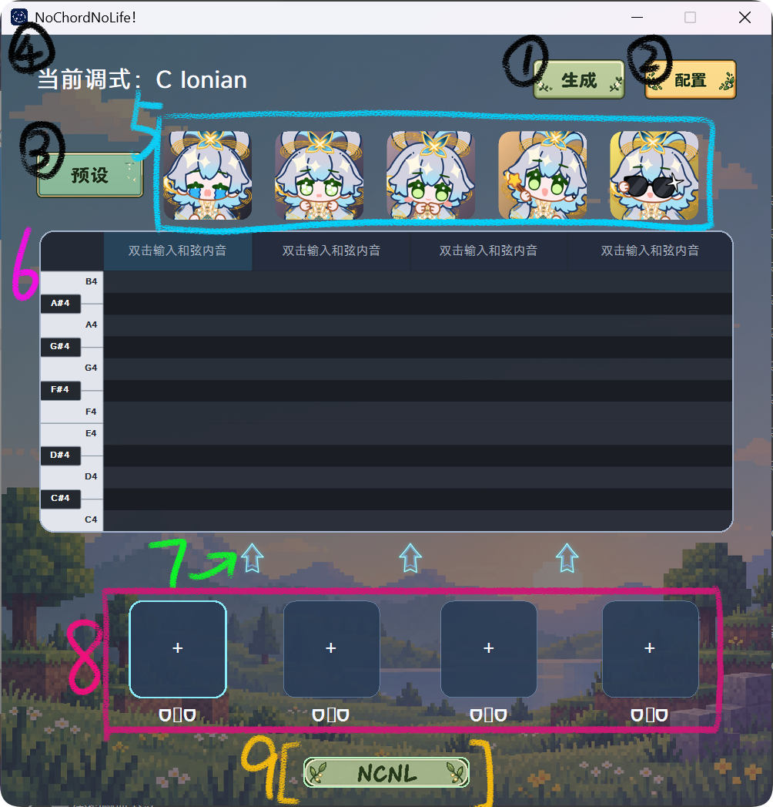
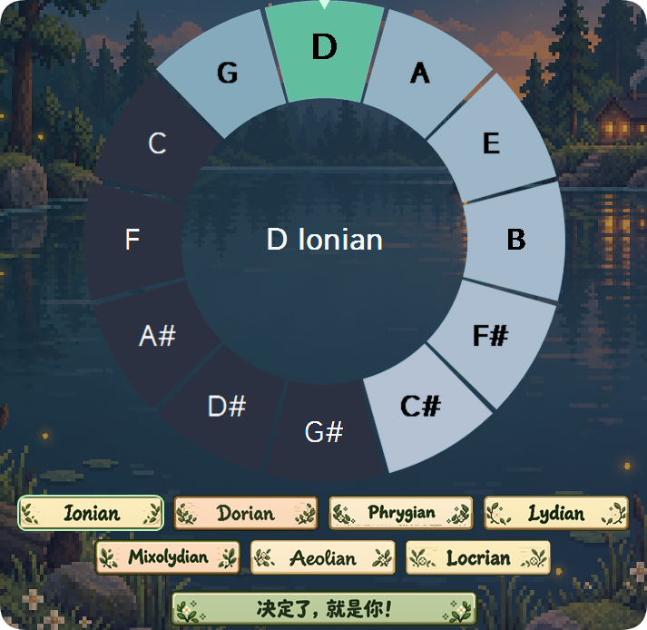
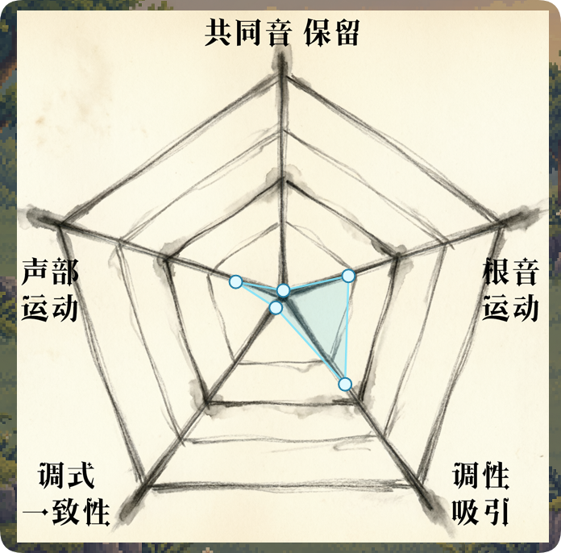
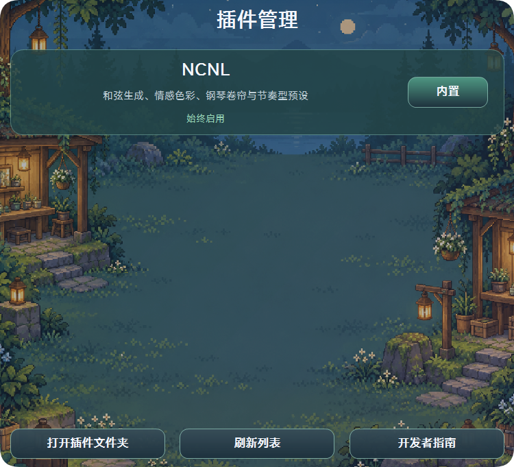
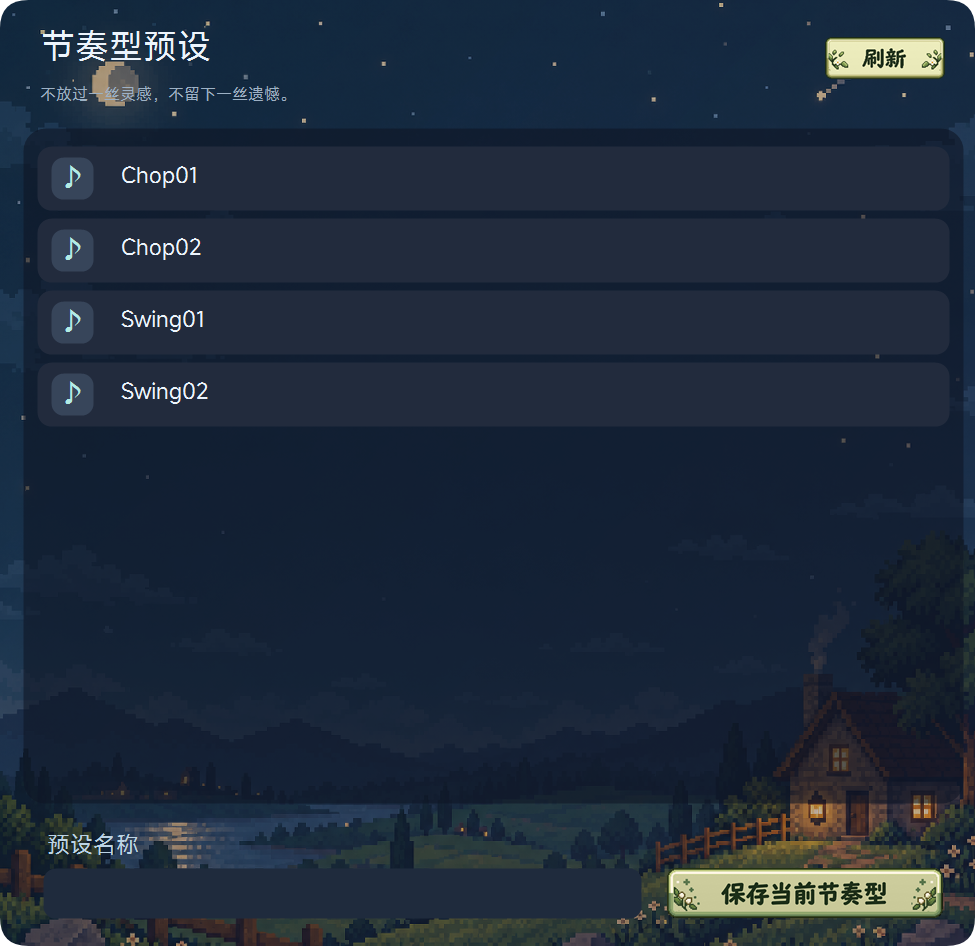
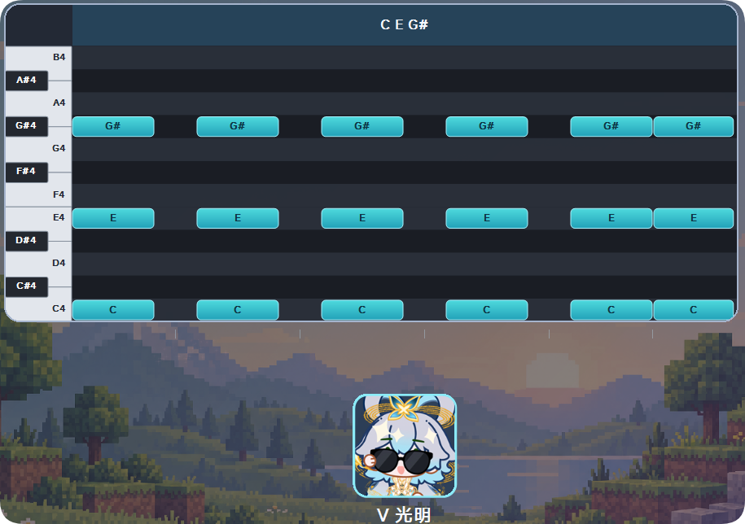

# [NCNL] NoChordNoLife/弦歌成囚

<span style="color: pink; font-size: 40px">待补充，别偷懒好不好你个大懒猫</span>

## 使用教程



### 1. 和弦进行生成按钮（快捷键为Enter）
推荐先继续阅读教程，先别急着<span style="color: pink; font-size: 18px">「生成」</span>。

### 2. 配置界面

打开后可对**调式**、**和弦进行评价标准**、**插件管理**进行配置。

#### 调式：


长按鼠标左键，转动这个五度圈，可以设置**调式的主音**（对，就是正上方的那个音）。<br>
五度圈下面的那七个，从Ionian到Locrian，便是七种中古调式。<br>
点击<span style="color: pink; font-size: 18px">「决定了，就是你！」</span>或按快捷键**Enter**可以应用调式配置。

#### 和弦进行评价标准：


一个五位雷达图，通过拖拽五边形的顶点实时调整和弦进行评价标准。<br>
这套标准用来衡量和弦进行是否流畅。如果没有这套标准，那和弦生成完全就是随机、随便的。和弦行进不流畅的直接影响是听感刺耳、无逻辑。

#### 插件管理：


<span style="color: #b4fc40; font-size: 15px">暂时没什么用。</span><br>
在这里配置附加插件的启用/禁用情况。

### 3. 预设界面



双击加载已有的节奏型预设（初始自带四种预设）；

**右键**划过预览界面中的预设可以把预设删除至回收站<br>
（可通过Ctrl+Z撤销删除操作）

也可选择保存当前界面中的节奏型。<br>
单击某个预设后，可在下方的<span style="color: pink; font-size: 18px">「预设名称」</span>编辑栏直接设置预设名称，或通过快捷键F2修改预设名称。

### 4. 当前调式

这里的调式主要指 调式主音+七种中古调式的一种。<br>
例如，C Ionian中，C指调式的主音，Ionian是七种中古调式中的一种，俗称**大调**。

关于调式的知识可自主搜索或观看[五度圈与中古调式](https://www.bilibili.com/video/BV1PU8y6VE3q)。

### 5. 和弦情感块（模板）

根据[和弦色彩算法](src/algorithms/chord_emotion.cpp)，把和弦的情感色彩映射为0~100的评分。

| 预设 | 色彩值 E |
| --- | --- |
| I.黯然 | 0 ≤ E ≤ 20 |
| II.伤心 | 20 < E ≤ 40 |
| III.暧昧 | 40 < E ≤ 60 |
| IV.希望 | 60 < E ≤ 80 |
| V.光明 | 80 < E ≤ 100 |

较低的色彩值意味着黯淡的听感；较高的色彩值意味着明亮的听感。<br>
每20分做一道分界，可以划分出5个区域。


<span style="color: #66ccff; font-size: 15px">萌萌哒天依正在视奸你.png</span>

从左到右，情感色彩值升高，分别为：<br>
I.黯然；II.伤心；III.暧昧；IV.希望；V.光明。

### 6. 钢琴卷帘

左键快速创建音符，右键删除，空格键播放。<br>
可通过Ctrl+Z撤销。

### 7. 分块标记


鼠标中键添加分块标记，右键删除分块标记。<br>
可通过Ctrl+Z撤销。

由这个标记（小箭头）分开的两个和弦，将由不同的和弦内音组成——并因此可以设置不同的情感块，详见 <span style="color: #668cff; font-size: 15px">8. 和弦情感块（可设置）</span>。<br>
例如，箭头前的和弦是 C E G ，那么箭头后的和弦可能是 C F G ，可能是 G B D ,但绝不可能是 C E G 。

反之，如果没有通过这个小箭头分隔开，前后的和弦必然是相同的。


### 8. 和弦情感块（可设置）

长按鼠标左键，从 <span style="color: #668cff; font-size: 15px">5. 和弦情感块（模板）</span>中的模板情感块拖拽到这个上面，并可以告诉应用，你在这里预期得到具有怎样情感色彩的和弦。

例如，为某个和弦的情感块设置为 IV.希望 ，则按下<span style="color: pink; font-size: 18px">「生成」</span>按钮后，可以在此处获得一个听感明亮的和弦（例如大三和弦/大七和弦/增和弦等）。

右键可清除。

### 9. 插件显示界面

<span style="color: #b4fc40; font-size: 15px">没什么用，下面的可以不用看。</span>

应用提供了插件接口。在特定文件夹下，检索到指定范式，即可加载对应的插件。

这些插件可在配置中管理，选择启用或禁用。<br>
目前应用只具有主体本身（命名空间为NCNL，你可以把应用主体本身当成一个不可禁用的插件，它的名字叫NCNL），后续等待更新（详见<span style="color: #668cff; font-size: 15px">未来开发计划</span>）。


## 项目结构

```
NoChordNoLife
├─ src/                         C++源码（桌面版/插件版）
│  ├─ algorithms/               核心算法（和弦色彩评分、和弦行进评分等算法，算法实现详见源码中的注释）
│  ├─ generation/               候选和弦与随机进行搜索算法
│  ├─ config/                   权重归一化、config.json读写（config存有和弦行进五维权重数据）
│  ├─ midi/                     MIDI解析/编码/播放/卷帘音名适配
│  ├─ ui/                       Win32界面/预设库/粒子效果/文件拖放
│  ├─ plugins/                  扩展接口/管理器/////////示例（？
│  ├─ resources/                嵌入资源索引/Windows 资源文件
│  └─ tools/                    图标/材质处理工具
├─ assets/                      图片/字体/鼠标ani文件资源
├─ figure/                      保存README中的图像等资源
├─ presents/                    四种 MIDI 初始预设及顺序信息（order.txt）
├─ config.json                  和弦进行评估五维权重配置持久化保存
├─ LICENSE                      代码许可
└─ README.md                    读读我
```

## 编译

```
cd D:\Desktop\NoChordNoLife
powershell -NoProfile -ExecutionPolicy Bypass -File .\src\tools\build.ps1
```
其中 `D:\Desktop\NoChordNoLife` 仅是示例路径，编译时请填入您的正确的路径！


## 算法实现原理

<span style="color: pink; font-size: 40px">待补充，别偷懒好不好你个大懒猫</span>

## 开发者指南

<span style="color: pink; font-size: 40px">待补充，你直接说只有你会当这个项目的开发者得了，这样偷懒还名正言顺</span>

## 项目借引/参考

初音未来款式的鼠标ani文件来自于[【初音未来】鼠标指针，来喽！](https://www.bilibili.com/video/BV1bG4y1x7YY)；

FL Studio等DAW宿主软件的[插件开发指南](https://www.image-line.com/fl-studio-learning/fl-studio-beta-online-manual/html/plugins_supported.htm)。

## 未来开发计划
※ 增加联网检索更新功能（？

※ 把文本全部修改为键，通过键值对映射的方式显示文本，<br>
这样可以通过修改映射的值实现对文本的修改，<br>
以实现对各种文本，比如英文/日文/猫言猫语（？的支持；

※ 开发NCNL的插件，已经想好了倒是——<br>
实时读取传入的midi音符，在五度圈上实时显示构成的几何图形，或许会有利于 *和弦几何学* 的研究，<br>
<span style="color: #e14119; font-size: 15px">
⚠ 但这种功能只能用于插件版，只有插件能对接入宿主软件实时传入的midi。</span>